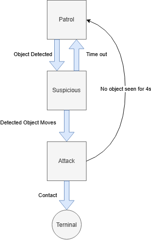

# **RoboBehaviors and Finite State Machines Project**

Author Names: Harlan Haller, River Lewis

For Olin ENGR3590 Computational Introduction to Robotics

## **Project Overview**

The goal of the FSM project is to develop a robot that can move through a set of states, with different behaviors at each state and different conditions that can trigger transitions between states. For our FSM we took inspiration from a guard dog patrolling an area. We decided to implement this through a distributed network of nodes, each running a behavior or providing support, where each node could change the active state and with no centralized control. From this project our biggest takeaway is that spending time planning thoroughly and setting up clean, usable architecture will pay off later.

## **Individual Behaviors**

The 3 behaviors we implemented into our FSM are: Patrol, Suspicious, and Attack. Below we give details about these behaviors and one behavior we wrote in class but chose not to include in our final, Drive in Square.

### **Behavior 1: Patrol (Wall Following)**

The patrol node is the entry point of our FSM. It implements wall following to “patrol” in circles around an object to its left. While patrolling it will look for any object on its right half that it deems "suspicious." If it sees an object it will transition to suspicious behavior. It will not trigger on the object last watched by the suspicious node. This is to avoid constantly triggering on the same object.

To implement wall following we subscribe to /detected\_clusters to get vision information, we then publish drive commands to /cmd\_vel. We use two control l P oops to keep tracking the wall. One keeps the distance from the wall to the Neato constant, the other tries to keep the closest point at pi/2 rad. The second loop is what ensures we turn when reaching the corner of the object by the error increasing as the closest point gets further behind the Neato. Any cluster detected to the right of the Neato (theta \< 0\) will trigger Suspicious, unless it is in a dead zone. The “dead zone” is a position on /dead\_zone we subscribe to published by Suspicious whenever it times out. We filter out any objects within a parameterized radius of the dead zone before deciding to trigger Suspicious

The most significant design decision involved with the patrol node is the decision to have it operate on objects detected by the object detection node (described below) instead of raw scan data. This decision arises out of a desire to handle scan data in exactly one place and distribute simplified object data to the behaviors that need them. This choice leads to the relatively simple wall following algorithm of trying to keep the closest point on the target object directly to the Neato’s left. However, what we gain in simplicity, we lose in flexibility \- the Neato must start with the object it’s guarding already off its left, and cannot, for example, approach an object head on and start circling it. This tradeoff is acceptable as the start conditions are controllable and the gain in code simplicity is significant.

This behavior is demonstrated in [complete\_fsm\_demo.bag](https://github.com/HarlanHaller/ros_behavior_fsm/tree/main/bags/complete_fsm_demo.bag), between startup and when “suspicious" is broadcast on the `/current_state` topic. It is also shown in the GIF below, extracted from the [complete demo video](https://youtu.be/vhD9_3_0Jac).

### **Behavior 2: Suspicious (Turn-to-angle and object tracking)**

The Suspicious behavior has many sub-states in it. The intent with this behavior is that when an object is detected while patrolling, the neato should stop, turn to face the object, then watch the object for up to a set timeout length (5s). If the object does not move then the Neato turns back to its original angle and keeps going on its way, if the object moves then the neato attacks it. This breaks down into 4 sub-states. Setup, or where the Suspicious node locates the Point of Suspicion (PoS) ; Turning, where the Neato is turned to face the PoS with a P loop; Watching, where if the PoS moves a significant amount we either start attacking or progress to; Turning Back, where the Neato turns back to its original heading and then starts the Patrol behavior.   
To implement this we keep an internal variable in the suspicious node called mode which can be in either: ‘Setup’, ‘Turning’, ‘Watching’, or ‘Turning Back’. The mode is used to enable or disable different functionality. This node subscribes to /current\_state for the overall FSM state, /detected\_clusters to tap into our object detection, and /odom for feedback on the turning states. We use a set of guard clauses at the beginning of most callbacks to exit out of them quickly if they are not needed. We additionally run one timer for the main loop which executes different code for each mode of suspicion. This node publishes to three publishers: /cmd\_vel for motor control, /current\_state to change the state of the FSM, and /dead\_zone to tell Patrol what area to ignore when detecting objects.  
While in the setup mode we just run the callback subscribing to the object detection to try to acquire an initial position for the PoS detected in Patrol that sent us to Suspicious. Once we have located an object we record the amount to turn to look at the PoS and enter turning mode.   
While in turning mode we do not watch for updates to detected clusters because we want to require the start position for the object once we are looking at it anyway and it is wasted compute. While in turning, if an odometry start angle has not been recorded we set it otherwise we just update the current angle. During the main loop while turning we use a P loop to output a Twist command to turn the Neato towards the PoS. We then check the difference between our current angle and the start angle to see if we have turned within a tolerance value of the amount set to turn earlier (Note: this formula uses a method to avoid the discontinuity issue from 180 to \-180). If we are, we stop the Neato, record the time, and set the mode to watching.  
While in the watching mode when /detected\_clusters updates, if no start point for the PoS is set we set one, otherwise we just record the current position of the PoS. Then in the main loop we check if the PoS has moved more than a max allowable value. If it has, we change to the Attack behavior. We also check if the difference from start time to current time has changed more than a set timeout length. If it has, convert the current location of the PoS to a stamped point, use tf2 to convert it to the odom frame, Next we publish it to the /dead\_zone topic so patrol knows not to attack that location again. Finally, we set the mode to turning back.  
In turning back we run the same code as in turning except once complete we reset the node and move back to Patrol.  
We decided to clump all of these sub-behaviors into one Node because each is too small to be a reasonable behavior on its own. This structure requires a coordinator in the form of the main loop to handle the code that should run in each mode that wasn’t tied to a callback. While this structure did work for the Suspicious node, we would not use this in the future as it made code hard to work on and very messy. We did not start off with a set architecture in mind so functionality is split between the coordinator and many of the callbacks. This leads to issues where callbacks update in an order we are not expecting, requiring us to have many None checks and contingency handling. In the future we would put in the overhead to make an action server which could turn each sub-behavior into an isolated action which would clean up the code.  
For the rosbag of this feature see: complete\_fsm\_demo.bag. Below is a flow chart capturing the rough structure of the Suspicious behavior:  

And a GIF, extracted from the [complete demo video](https://youtu.be/vhD9_3_0Jac):  

### **Behavior 3: Attack (Person following and emergency stop)**

The purpose of the Attack behavior is to drive at the object detected as threatening until it runs into that object. This is the last-reached, and almost always terminal, state in the state machine. Conceptually, this is a combination of person following with a target distance of zero and an emergency stop.

The node begins by selecting the object to attack. Because it is only entered from the suspicious behavior, whose job is to point the Neato towards specific objects, it selects as its target the object which is closest to its forward direction in angle. Once its target is selected, it is stored, in the `odom` frame, for future reference. When the next object detection update arrives, the newly scanned object that is closest to the target’s last stored position is selected and stored as the target. This process continues until impact. (If no objects at all are detected for a while, the node broadcasts a transition back to `patrol`. In practice, however, this is very rare.) A proportional controller is used to attempt to drive the angular error between the target’s heading relative to the neato and the neato’s forward direction to zero by controlling angular velocity. Linear velocity is pinned at 0.3m/s, the Neato’s maximum supported speed. (When a combination of high requested linear velocity and high requested angular velocity would cause a Neato’s wheel to exceed 0.3m/s, the entire velocity vector is scaled, which means that constantly requesting a linear velocity of 0.3m/s does not cause the angular velocity to be ignored. This behavior is implemented [here](https://github.com/comprobo26/neato_packages/blob/main/neato_node2/neato_node2/neato_node.py#L254) in `neato_packages`.) When a bump sensor is triggered, the node immediately commands a zero velocity, and broadcasts an entry to `terminal` state, which deactivates all nodes.

Mechanically, this behavior node subscribes to `/detected_objects` for object data, `/current_state` to know when to activate, and `/bump` for its emergency stop. It publishes to `/cmd_vel` to control the Neato and `/current_state` to publish `terminal` and `patrol` state updates. Additionally, it publishes debug information to `/attack_target`, which is the point the Neato is currently targeting, and `/object_xform_odom`, which was used when figuring out the various `tf2` transforms. This node is not multithreaded, and has only one nontrivial callback: `on_detected_objects`, which handles all of the above logic except for the emergency stop and state entry/exit.

The decision to segment the attack behavior as its own node is fairly natural, as once the decision is made to attack, nearly all state from previous behaviors stops mattering. Less natural is the problem of tracking a moving target across updates from an equally moving LiDaR platform. The segmentation of object detection logic, described below, is  helpful, but provides locations in the `base_link` frame since that format is most natural for the other nodes. To handle this tracking, we use `tf2` to manage projections between the `odom` and `base_link` frames. However, we ran into several issues with `tf2`. The most prevalent one is that it refuses to make projects on points measured after its most recent transformation update. This led to errors like `Cannot transform new_target_point into base_link, since that would require projecting 0.1sec into the future`. We would be okay with just using the last known transformation, but could not figure out how to communicate this to `tf2`. After multiple hours of trying to do this the Right Way, we gave up and adjusted the timestamps on all our points 0.2 seconds into the past. This works well enough for us, but is obviously not something that should be repeated on future projects. We choose to perform all navigation and control in response to new LiDaR scans, only incorporating `odom` updates implicitly through `tf2` transforms. This is justified by the fact that new LiDaR scans arrive frequently enough that the chance to apply feedback from a `/odom` update to navigate to a relatively stale target location would be unlikely to result in significant performance improvement. Additionally, many smaller design decisions were made with the intent of trading off reduced maintainability, elegance, and precision to achieve a functional node in the time available, all largely justified by the fact that the behavior node works well enough in practice and accomplishes the goals initially set out for it.

This behavior is demonstrated in [complete\_fsm\_demo.bag](https://github.com/HarlanHaller/ros_behavior_fsm/tree/main/bags/complete_fsm_demo.bag), between when `”attack”` is broadcast on the `/current_state` topic and when “terminal” is broadcast on the same. It is also shown in the GIF below, extracted from the [complete demo video](https://youtu.be/vhD9_3_0Jac).

### **Supporting Node: Object Detection**

In order to reduce code duplication, we extract object detection logic to an independent node. This object detection node consumes LiDaR data and publishes a list of objects that are subscribed to by all three behavior nodes. This allows simplification of behavior nodes. For example, the patrol node can simply worry about keeping an object directly off its right side, and the attack node only needs to pick which currently visible object ought to be attacked, without dealing with the complexity of various LiDaR points appearing and disappearing over time.

Object detection is accomplished with the use of a hierarchical clustering approach, provided by the scikit-learn library. The points scanned by the LiDaR are first filtered to throw out points considered too close or too far away, then projected from polar coordinates to cartesian coordinates in the `base_link` frame. These points are then passed into the clustering algorithm along with a distance threshold. The clustering algorithm effectively groups any two points that are closer to each other than the distance threshold into the same cluster until no point has any neighbors closer than the threshold that are not already in its cluster. Specifically, we use the `AgglomerativeClustering` algorithm in `single` linkage mode. This algorithm was chosen because it does not require pre-existing knowledge of the number of clusters to find, and has simple and easy-to-tune parameters. (As a side note, it’s worth checking out [scikit-learn’s comparison of clustering algorithms](https://scikit-learn.org/stable/modules/clustering.html) \- it’s very well-presented, and clustering shows up as a useful technique in surprisingly many places.)

Combined with the previous filtering on point distance and additional filtering to throw out clusters that are only one or two points, this process reduces the 360 ranges to a much more manageable handful of clusters. The closest point to the Neato in each cluster is selected as the representative point of that cluster, and packaged into a `PointCloud2` for broadcast to the behavior nodes.

### **Behavior \[unused\]: Drive in square**

The drive in square behavior is unused in our FSM. It, as the name suggests, drives the neato in a square. The square is hard coded to be 1mx1m. We chose to use odometry data instead of pure timing to track our progress.  
	We implement drive square as a combination of two internal states, driving forward and turning. This node subscribes to /odom to get updates about where it is. At the beginning of either driving forward or turning we record the current position, then for each frame we check if we have turned or driven the amount set, if so we stop if not we continue at a set speed. This node publishes to /cmd\_vel to output the turn and drive commands.  
	Our main design decision for this node was to use odometry data over timing. We did this to increase our accuracy when turning and driving. We did find the neato still consistently overshoots the specified turn angle with odometry data, likely due to network latency and the odometry values slipping. However, this can be mitigated largely by using a manual “fudge factor” decreasing the amount the Neato is told to turn. This method includes no more manual tuning than using timing, and we feel provides extra flexibility.  
	For a rosbag of this behavior see: [drive\_square\_unused.bag](https://github.com/HarlanHaller/ros_behavior_fsm/tree/main/bags/drive_square_unused.bag). This bag is recorded on the physical Neato, but we did not take a recording so the recording below is obtained with the simulator. Here is the video recording: [Drive square recording](https://drive.google.com/file/d/18Qxfe2-NZ85QgtY2ugV_zO4RRItPQaBr/view?usp=sharing)   
	

## **Finite State Machine**

### **Overall Design**

A Neato running this project is intended to act as a “guard dog” \- that is, to be able to patrol around an object, detect possible threats, and attack the threats if they persist. The Neato wall-follows around the object it’s protecting, scanning for threats to appear in its LiDaR data. If it detects a threat, it turns to face the threat, and waits to see if the threat moves. If it doesn’t, the Neato returns to patrol, but if the threat does move, then the Neato “attacks”: it chases the threat at full speed until collision.

### **Implementation Details**

This finite state machine was implemented in a decentralized way. We had no orchestration node, only the three behavior nodes, which all coordinated state transitions with each other. Each node was in charge of its own exit criteria, and when those criteria were met, the node currently running would cause a transition by broadcasting the name of a different node onto the `/current_state` topic. All behavior nodes were subscribed to this topic, and when a message is received on that topic, each node activates itself if the message is its own name, and deactivates itself otherwise. This has a side effect that a terminal state can be entered by a node simply broadcasting `”terminal”` \- this doesn’t match the names of any nodes, so all nodes will deactivate themselves.

In this section, you will describe how you implemented your finite state machine, with pointers to relevant code in the repository.

### **Demonstration**

Here is a youtube link to our complete FSM demo: [link](https://youtu.be/vhD9_3_0Jac)  
 It overall performs as we wanted it to. There are a few small performance things that could be improved however they are insignificant.

The complete rosbag for the FSM is available at [/bags/complete\_fsm\_demo.bag](https://github.com/HarlanHaller/ros_behavior_fsm/tree/main/bags/complete_fsm_demo.bag).

## **Learning Objectives and Final Takeaways**

In this section, please report on each individual's learning objectives with this project and key takeaways. If there are any collective takeaways to report (such as possible future work), you may also report these here.

### **River’s Learning Objectives**

* **Conventions and practices of robotics programming**  
  In this project, we used several common practices, such as multi-node architecture, use of tf2 and multiple frames, and dependency management with rosdep. We found various amounts of success with each of these practices, but I still found the experience of working with them to be useful, and I think I’ll be able to use them more effectively next time. Additionally, we considered and ultimately decided not to use action servers, because we didn’t think the gain in code clarity and idiomaticity would be worth the increased overhead of defining custom action interfaces. Even so, I still think the exercise of making that decision was useful, because I learned a lot about how actions work and what is needed to implement them.  
* **Production and integration of multi-author software**  
  We used two main approaches to collaboratively write software: pair programming and separated development followed by integration. I found that pair programming was useful in helping to make sure both of us had a good sense of the overall scope and approach of the project, but was less productive than separate development. I think we found a good balance, and will try similar approaches in the future.  
* **Familiarization and positive use of generative AI**  
  We used AI very sparingly in this project, only engaging it in a handful of cases. These were generally situations that called for selection from a large amount of text, such as finding a particular function across all of the tf2 packages, or finding a copy-paste error hiding somewhere in a large function. This was a change from my usual style of software development, where I tend to use AI tab-complete for both boilerplate and for implementing obvious or simple snippets. This caused me to think at a lower level of abstraction than usual \- more about things like “which specific message type do I want to be using for this topic” and “which PointCloud2 method will read these points in the way that I want” instead of “how do I want to structure this behavior” and “what approach do I want to use for point clustering.” I’m not sure if this is a straightforwardly positive thing, though \- while this did help me get a good sense of exactly what functionality ROS provides, I think I wrote code both more slowly and with more bugs than I would have with the help of tab-complete. I also feel a bit of pressure from the industry side to get used to using *much* more AI in my development \- as in fully-agentic, barely-read-the-code-that-runs style. I feel like *that* would be counterproductive to my actual learning about the subject, but I’m not sure where the balance lies between my understanding of my code, the efficiency of my development, and my acquisition of robotics and software development skills.

### **Harlan’s Learning Objectives**

The only learning goal I meaningfully progressed towards was “Project Development Competency in ROS.” To progress towards this learning goal I was the one who created the repository, made the launch file, and did several other background architecture tasks. I definitely feel I have made a good amount of progress in this aspect but there is still a lot more I want to learn. I could have made progress towards my robot vision goal, but I did not take on the object detection support node. If I were to do this project again I might take on the task.

### **Final Takeaways**

* Spend more time planning intra-node structure before beginning development. This would have helped avoid some of the spaghettification in the Suspicious behavior.  
* For any projects larger than this one, it’s untenable to not use action frameworks and/or custom messages \- the time spent setting them up will be more than made up in time not spent troubleshooting.  
* Be careful with external dependencies. Adding scikit-learn to the standard CompRobo setup is difficult to do cleanly. Look into solutions like [RoboStack](https://robostack.github.io/) for more isolated workspaces and more modern dependency management.

## **How To Run**

1. Set up an appropriate ROS2 Jazzy workspace with the [standard CompRobo instructions](https://comprobo26.github.io/How%20to/setup_your_environment).
2. Clone this repository into `<your_ros_workspace>/src/ros_behavoir_fsm`.
3. Install the `scikit-learn` Python package, which is used for LiDaR point clustering. If your workspace is set up according to the standard CompRobo instructions, then `python -m pip install --break-system-packages scikit-learn` should do the job. (If you land in Numpy dependency hell, you have our condolences \- you might try `sudo apt install python3-sklearn` instead, but unfortunately no single solution can guarantee your escape.)
4. From the root of your workspace, run `colcon build --symlink-install` and re-source all your ROS2 workspace setup files.
5. Either connect a physical Neato or start Gazebo. Place the Neato about 30cm to the right of the object it is to guard. There should be nothing else within a \~2-3 meter radius of the guarded object.
6. Run `ros2 launch ros_behavior_fsm guard_neato.py`. The Neato should guard the object as described above until you Ctrl+C, it hits something, or until something goes wrong.
